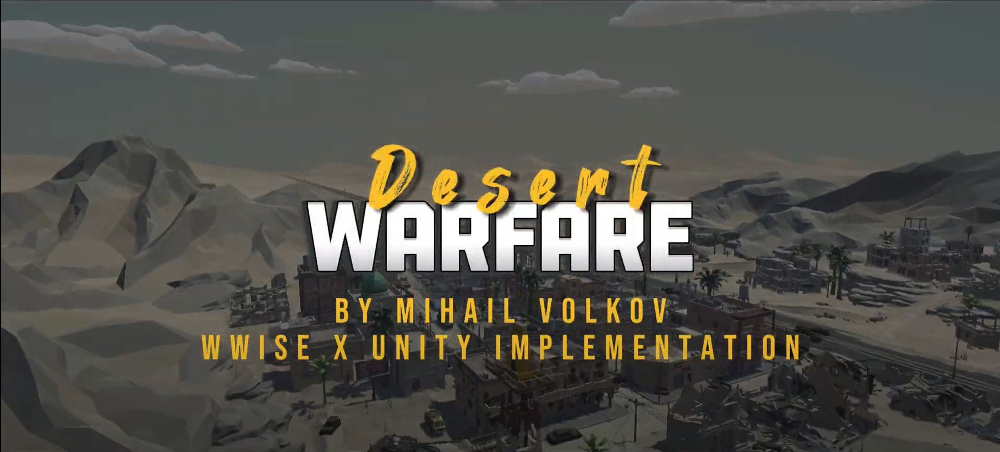
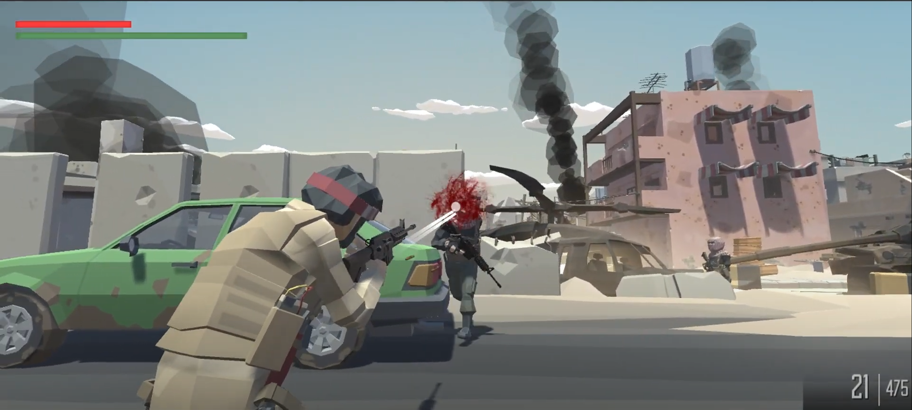
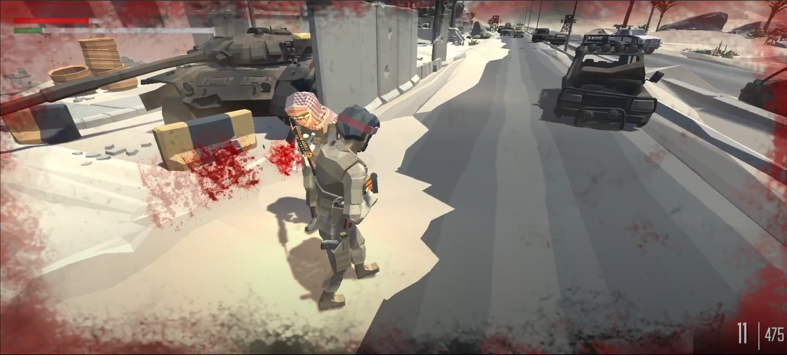
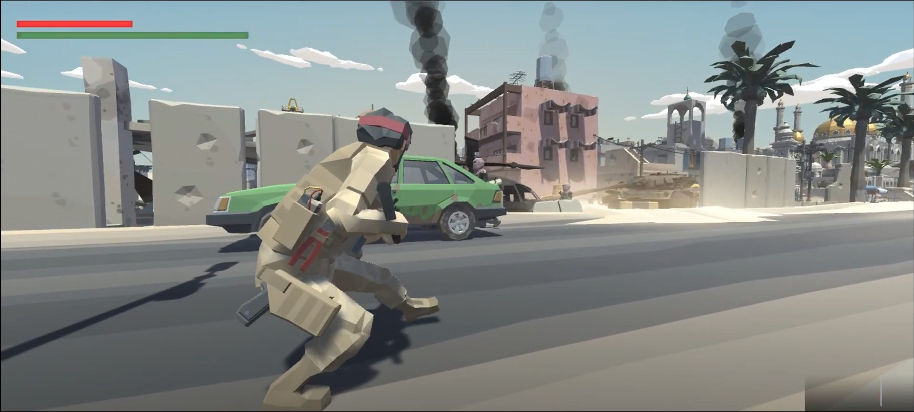
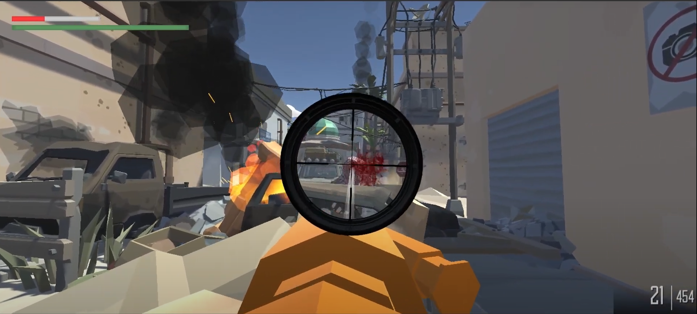
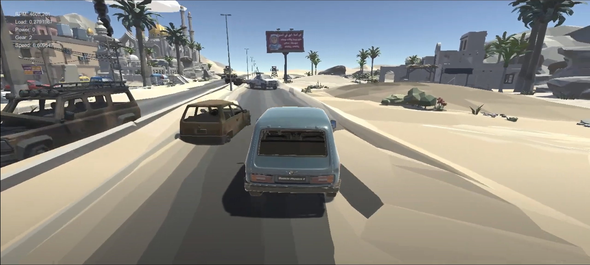
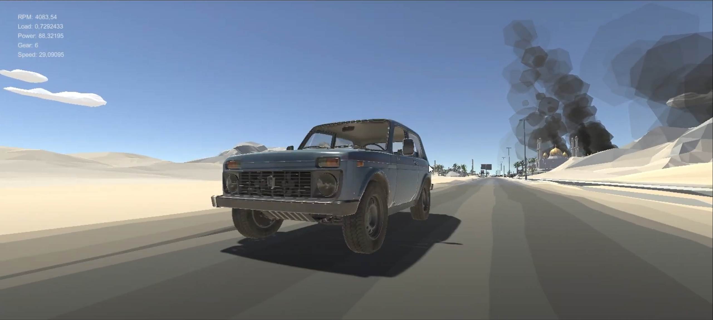
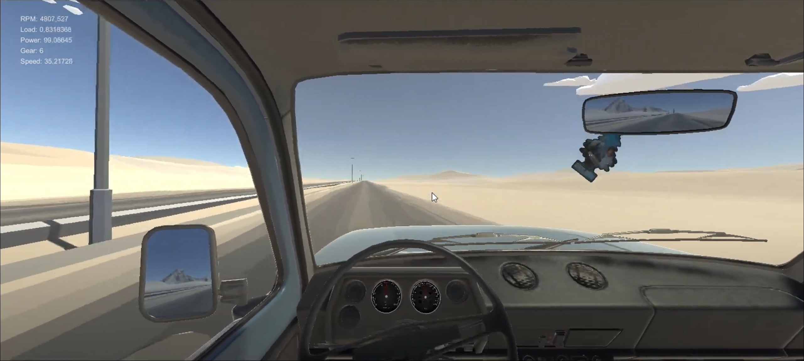

## "Desert Warfare" Unity x Wwise implementation reel
Demo project for realizing the possibility of Wwise imlementation in Unity

## Screenshots

## How to start a project
Download the folder "Class11-Weapon"----- Go to Unity Hub and click Add---- Select the folder and open the project.
